<div align="center">

<!-- Animated Header Banner -->


<!-- Typing Animation -->
<a href="https://git.io/typing-svg"></a>

<!-- Badges -->
<p>
  
  
  
</p>

<p>
  
  
</p>

</div>

---

## About

**RouteGo** is an intelligent bus route discovery and travel planning application for Sri Lanka. Built with the **Jac programming language** and powered by **LLM-based AI agents**, it provides real-time bus search, route filtering, and an AI-powered chatbot assistant.

<div align="center">
<table>
<tr>
<td width="33%" align="center">

**Smart Search**<br/>
<sub>Filter by time, type & route</sub>

</td>
<td width="33%" align="center">

**AI Chatbot**<br/>
<sub>Natural language queries</sub>

</td>
<td width="33%" align="center">

**Graph Database**<br/>
<sub>Efficient pathfinding</sub>

</td>
</tr>
</table>
</div>

---

## 🎬 Demo Video

<div align="center">

[](https://youtu.be/_gIW9ozB6FE)

*Click the thumbnail above to watch the demo on YouTube*

</div>

---

## 📸 Frontend UI

<div align="center">


*RouteGo Frontend Interface*

</div>

---

## Features

<table>
<tr>
<td>

### Smart Bus Search
- Search buses between cities with time-range filtering
- Filter by bus type (Normal, Semi-Luxury, Luxury)
- Filter by route type (Direct, Via/Intermediate)
- Real-time fare and schedule information

</td>
<td>

### AI-Powered Chatbot
- Natural language bus route queries
- Travel time calculations using ReAct methodology
- Intelligent routing through multiple AI agents
- Context-aware responses powered by Gemini 2.0 Flash

</td>
</tr>
</table>

---

## System Architecture

```mermaid
flowchart TB
    subgraph Frontend["🎨 Frontend Layer"]
        A[🏠 HeroSection] 
        B[🔍 SearchBusTable]
        C[💬 ChatBot]
    end
    
    subgraph JacEngine["⚡ Jac Runtime Engine"]
        subgraph Walkers["🚶 Walker Orchestration"]
            D[📊 createGraph]
            E[🔎 filterBuses]
            F[🗺️ findRoutes]
            G[🤖 agentAI]
        end
        
        subgraph LLM["🧠 LLM Integration"]
            H[🌟 Gemini 2.0 Flash]
        end
    end
    
    subgraph Database["📦 Real Graph"]
        I[🏙️ City Nodes]
        J[🚌 Bus Nodes]
        K[🔗 Route Edges]
    end
    
    A --> D
    B --> E
    B --> F
    C --> G
    G --> H
    D --> I
    E --> I
    F --> I
    I --> J
    I --> K
    
    style Frontend fill:#1a1a2e,stroke:#667eea,stroke-width:2px,color:#fff
    style JacEngine fill:#16213e,stroke:#764ba2,stroke-width:2px,color:#fff
    style Database fill:#0f0f23,stroke:#ff7f32,stroke-width:2px,color:#fff
    style Walkers fill:#252550,stroke:#667eea,stroke-width:1px,color:#fff
    style LLM fill:#252550,stroke:#4285F4,stroke-width:1px,color:#fff
```

<div align="center">



</div>

### Core Components

| Component | Description |
|:---------:|-------------|
| **Nodes** | `City` (start/end points), `Bus` (vehicle details) |
| **Edges** | `busRoute` (route connections), `busEdge` (bus assignments) |
| **Walkers** | Graph traversal agents for search and AI operations |
| **LLM** | Gemini-powered natural language processing |

---

## Tech Stack

<div align="center">

| Technology | Purpose | Badge |
|:----------:|---------|:-----:|
| **Jac** | Backend with graph semantics |  |
| **Jac-Client** | Frontend runtime for web UI |  |
| **Gemini 2.0** | LLM for NLP |  |

</div>

---

## Project Structure

```
route-go/
├── app.jac              # Main application entry point
├── utils.jac            # LLM utility functions
├── chatBot.jac          # AI chatbot component
├── HeroSection.jac      # Landing page hero section
├── SearchBusTable.jac   # Bus search interface
├── package.json         # Node.js dependencies
├── src/                 # Compiled Jac-Client components
└── build/               # Production build output
```

---

## Quick Start

<details>
<summary><b>Click to expand installation steps</b></summary>

### Step 1: Clone the Repository
```bash
git clone https://github.com/RavimalRanathunga/RouteGo.git
```

### Step 2: Navigate to the Project
```bash
cd RouteGo
```

### Step 3: Create a Python Virtual Environment
```bash
python -m venv .venv
```

### Step 4: Activate the Virtual Environment

<table>
<tr>
<td>

**macOS/Linux:**
```bash
source .venv/bin/activate
```

</td>
<td>

**Windows:**
```bash
.venv\Scripts\activate
```

</td>
</tr>
</table>

### Step 5: Install Jac and Dependencies
```bash
pip install jaclang jac-client
```

### Step 6: Navigate to the Route-Go Directory
```bash
cd route-go
```

### Step 7: Install Node.js Dependencies
```bash
npm install
```

### Step 8: Set Up Environment Variables

<table>
<tr>
<td>

**macOS/Linux:**
```bash
export GEMINI_API_KEY="your-api-key"
```

</td>
<td>

**Windows (PowerShell):**
```powershell
\$env:GEMINI_API_KEY="your-api-key"
```

</td>
</tr>
</table>

</details>

### ▶️ Running the Application

```bash
jac serve app.jac
```

<div align="center">

**Application URL:** `http://localhost:8000/page/app`

</div>

---

## Key Walkers

<div align="center">

| Walker | Function |
|:------:|----------|
| `createGraph` | Builds the full bus network graph |
| `findRoutes` | Finds available route numbers between cities |
| `filterBuses` | Filters buses by time, route, bus type |
| `findGraph` | Checks if graph has been created |
| `agentAI` | LLM-powered intent detection & routing |
| `computeBusTimeAgent` | Calculates travel time (ReAct method) |
| `computeIntermediateStops` | Finds intermediate stops on shortest route |
| `findRoutesAgent` | Agent version for AI orchestration |
| `filterBusesAgent` | Agent version for AI orchestration |

</div>

---

## AI Chat Examples

<div align="center">

```
┌─────────────────────────────────────────────────────────────┐
│  👤 User: "What routes go from Colombo to Jaffna?"          │
│  🤖 Bot:  "Available routes: 57, 87"                        │
├─────────────────────────────────────────────────────────────┤
│  👤 User: "How long does a luxury bus take?"                │
│  🤖 Bot:  "Based on 80 km/h speed and 2 stops..."           │
├─────────────────────────────────────────────────────────────┤
│  👤 User: "Find buses between 8 AM and 12 PM"               │
│  🤖 Bot:  Lists all departing buses in time window          │
└─────────────────────────────────────────────────────────────┘
```

</div>

---

## Supported Routes

<div align="center">

| From | To | Routes | Distance |
|:----:|:--:|:------:|:--------:|
| Colombo | Jaffna | `57`, `87` | ~400 km |
| Jaffna | Colombo | `57`, `87` | ~400 km |
| Colombo | Kandy | `01` | ~120 km |

</div>

---

## Bus Types & Fares

<div align="center">

| Type | Speed | Fare Range |
|:----:|:-----:|:----------:|
| Normal | 40 km/h | Rs. 500 - 1,600 |
| Semi-Luxury | 60 km/h | Rs. 1,200 - 2,200 |
| Luxury | 80 km/h | Rs. 2,800 - 3,000 |

</div>

---

## UI Components

<div align="center">

<table>
<tr>
<td align="center" width="33%">

### Hero Section
Animated gradient background<br/>
Feature highlights<br/>
Smooth scroll navigation

</td>
<td align="center" width="33%">

### Search Table
City dropdowns<br/>
Time range selectors<br/>
Filter controls

</td>
<td align="center" width="33%">

### ChatBot
Floating chat button<br/>
Message bubbles<br/>
Real-time AI responses

</td>
</tr>
</table>

</div>

---

## Team

<div align="center">

| <a href="https://github.com/akindu-k"></a> | <a href="https://github.com/RavimalRanathunga"></a> | <a href="https://github.com/ThiruvarankanM"></a> |
|:--:|:--:|:--:|
| [**Akindu Kalhan**](https://github.com/akindu-k) | [**Ravimal Ranathunga**](https://github.com/RavimalRanathunga) | [**Thiruvarankan Mathurakaran**](https://github.com/ThiruvarankanM) |

</div>

---

<div align="center">

<!-- Footer Wave -->


**Built with ❤️ using Jaseci Stack**

<sub>A Jaseci-Powered Smart Routing System 🇱🇰</sub>

</div>
